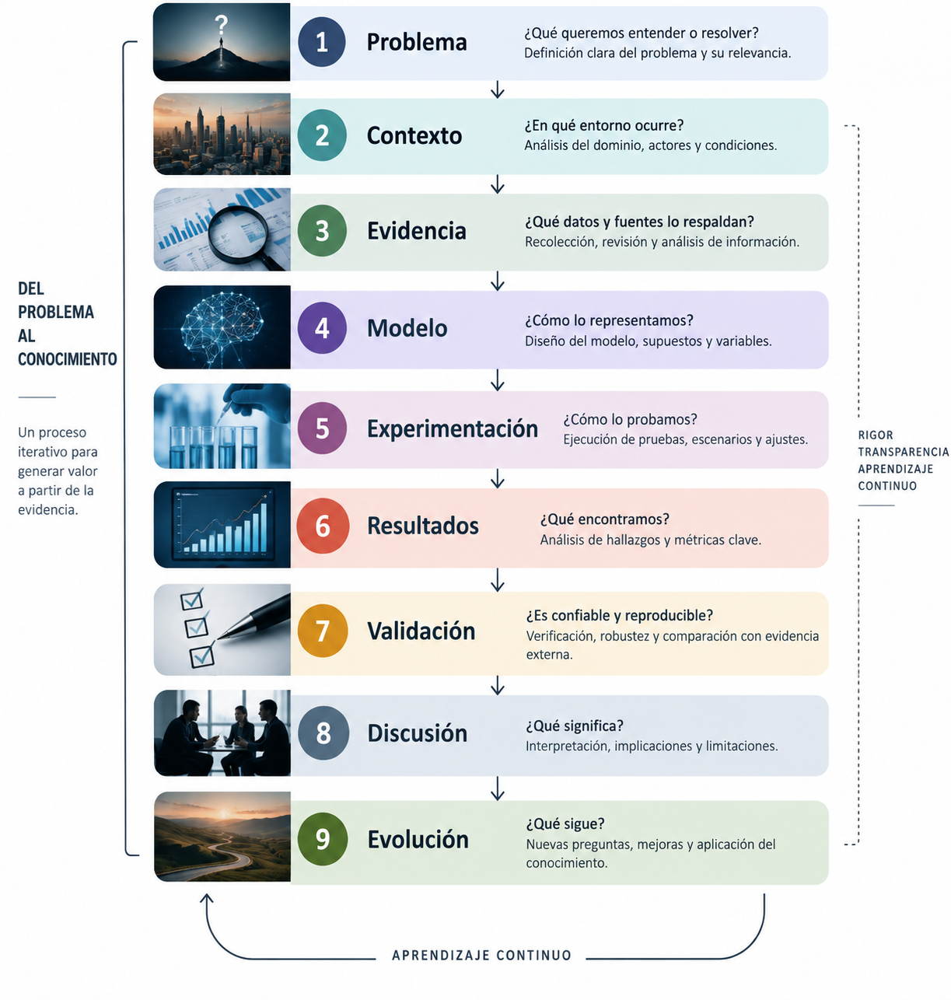

# Sidhartha Research

### Investigación · Ingeniería · Modelado · Datos

[](https://sidhartha-research.com/)
[](https://pages.github.com/)
[](https://sidhartha-research.com/)

**Sidhartha Research** es una plataforma personal de investigación orientada al estudio de problemas complejos mediante ingeniería, datos, modelado, simulación, análisis cuantitativo y colaboración interdisciplinaria.

El sitio funciona como la capa pública de los trabajos: presenta el problema, el contexto, la evidencia, los modelos, los resultados y las preguntas abiertas, mientras que el código, los datos y otros recursos técnicos pueden mantenerse en repositorios o artefactos especializados.

> **La investigación no termina cuando se publica.**

Cada trabajo puede evolucionar a partir de nueva evidencia, revisión especializada, experimentación, participación de otras personas o nuevas preguntas de investigación.

---

## Sitio web

**Sidhartha Research**

https://sidhartha-research.com/

El sitio reúne los trabajos publicados y en desarrollo, y proporciona una interfaz accesible para personas técnicas y especialistas de distintos dominios.

La intención es que una persona pueda comprender el problema y evaluar el trabajo **sin necesidad de comenzar leyendo el código fuente**.

---

## Propósito

Sidhartha Research nace de una idea sencilla:

> Los problemas complejos rara vez pertenecen a una sola disciplina.

Un modelo de ingeniería puede necesitar conocimiento médico.

Un análisis financiero puede requerir discusión sobre sus supuestos.

Una investigación social puede beneficiarse de métodos cuantitativos.

Un sistema computacional puede necesitar validación por especialistas del dominio que representa.

Por ello, los trabajos publicados aquí buscan separar y hacer visibles distintas capas del proceso de investigación:


<p align="center">
  
</p>

No todos los trabajos recorren exactamente las mismas etapas.
La metodología se adapta al problema, al tipo de evidencia disponible y al estado de desarrollo de cada trabajo.

---

## Trabajos
### 01 · Ingeniería & Futuro del Trabajo
Investigación · Ingeniería · Trabajo · IA

Estudio sobre la transformación del mercado laboral de la ingeniería en México y la evolución de las capacidades profesionales hacia 2030.
La publicación integra investigación, evidencia, análisis cuantitativo, visualizaciones, metodología, referencias y herramientas interactivas.

Publicación:

https://sidhartha-research.com/research/employment_trends/


### 02 · Simulación de un Departamento de Emergencias
Investigación · Salud · Simulación · Modelado

Proyecto orientado al estudio de procesos de atención en un departamento de emergencias mediante simulación de eventos discretos.
El trabajo busca representar procesos operativos, recursos, flujo de pacientes y escenarios experimentales, y posteriormente someter los supuestos y reglas del modelo a validación interdisciplinaria.

Estado: En desarrollo.

Repositorio:

https://github.com/SidharthaManriquez44/hospital-simulation

### 03 · Entre Cempasúchil y Calabazas
Investigación · Sociedad · Cultura · Participación

Trabajo de investigación orientado al estudio de prácticas, significados y transformaciones relacionadas con tradiciones culturales.
El proyecto contempla una dimensión documental y participativa, así como la recolección y análisis de evidencia mediante investigación de campo.

Estado: Investigación abierta · Recolección de datos.

### 04 · Hedge Fund
Finanzas · Datos · Análisis cuantitativo · Experimentación
Proyecto de investigación cuantitativa orientado al estudio de datos financieros, modelado, experimentación y desarrollo de estrategias.

Estado: En desarrollo.

## Arquitectura del repositorio
El repositorio funciona como la capa principal de publicación de Sidhartha Research.

```text
sidhartha-research/
│
├── index.html
│
├── research/
│   └── employment_trends/
│       ├── index.html
│       ├── research.html
│       ├── dashboard.html
│       ├── data.html
│       ├── engineer2030.html
│       ├── methodology.html
│       ├── references.html
│       ├── 404.html
│       ├── favicon.svg
│       │
│       └── assets/
│           └── figures/
│
├── README.md
└── .gitignore
```
### Capa de publicación
Contiene el sitio principal y las publicaciones web que forman parte de Sidhartha Research.

### Capa de investigación
Cada trabajo puede contener su propia estructura, metodología, recursos y artefactos.

### Capa técnica
El código de simulación, análisis, modelos y otros componentes especializados pueden vivir en repositorios independientes.
Esto permite que una publicación sea comprensible para especialistas del dominio sin obligarlos a navegar directamente por la implementación técnica.

---
## Investigación interdisciplinaria
Una de las funciones principales de Sidhartha Research es facilitar la revisión por personas que poseen conocimiento especializado del dominio estudiado.
La colaboración puede ocurrir en diferentes niveles:

| Dominio           | Posible contribución                                    |
| ----------------- | ------------------------------------------------------- |
| Salud             | Validación de procesos, reglas y supuestos              |
| Finanzas          | Revisión de supuestos, modelos y estrategias            |
| Ingeniería        | Modelado, procesos y validación técnica                 |
| Ciencias sociales | Diseño de investigación, participación e interpretación |
| Datos             | Metodología, análisis y reproducibilidad                |
| Tecnología        | Implementación, arquitectura y experimentación          |

El objetivo no es sustituir el conocimiento especializado mediante software, sino hacer posible que ese conocimiento forme parte del proceso de modelado y validación.

---

## Principios

1. La publicación es una capa de comunicación
La web no reemplaza el código, los datos o los modelos.
Los hace accesibles a diferentes públicos.
2. El código no es toda la investigación
Una implementación puede ser técnicamente correcta y representar incorrectamente el fenómeno que intenta estudiar.
Por ello, el contexto, las reglas, los supuestos y la validación son parte fundamental del trabajo.
3. Los modelos pueden ser cuestionados
Los modelos publicados deben poder ser discutidos, revisados y, cuando sea necesario, modificados.
4. La evidencia precede a las conclusiones
Las afirmaciones deben mantener una relación explícita con los datos, fuentes, supuestos o métodos que las sustentan.
5. Los trabajos evolucionan
Una publicación representa el estado de un trabajo en un momento determinado.
Nueva evidencia puede producir nuevas versiones, experimentos o preguntas

---

## Tecnología

La plataforma utiliza tecnologías web estándar para la capa de publicación:
* HTML 
* CSS 
* JavaScript 
* Git 
* GitHub 
* GitHub Pages

Los trabajos individuales pueden utilizar tecnologías diferentes según sus necesidades, incluyendo herramientas para:

* análisis de datos
* simulación
* estadística
* machine learning
* modelado
* visualización 
* investigación cuantitativa

La tecnología utilizada en cada trabajo se documenta dentro de su propio contexto.

---
### Desarrollo local

El repositorio está diseñado para desarrollarse localmente y posteriormente publicarse mediante GitHub Pages.

Clonar el repositorio:

```bash
git clone https://github.com/SidharthaManriquez44/sidhartha-research.git
cd sidhartha-research
```

Para desarrollo y edición puede utilizarse cualquier entorno compatible con HTML/CSS/JavaScript

---
## Autor
Sidhartha Manríquez González

Ingeniería · Datos · Modelado · Investigación aplicada

GitHub:
https://github.com/SidharthaManriquez44

Sitio:
https://sidhartha-research.com/

---

## Participación
Los trabajos publicados pueden encontrarse en diferentes etapas de desarrollo.
Cuando un trabajo requiera conocimiento especializado, revisión metodológica, validación de supuestos o participación, dicha necesidad se indicará dentro de su propia publicación.
La colaboración puede contribuir a:

* detectar supuestos incorrectos
* mejorar modelos
* aportar evidencia
* identificar limitaciones
* proponer nuevos experimentos
* validar interpretaciones
* generar nuevas preguntas de investigación

---

## Licencia
La licencia de cada trabajo puede variar de acuerdo con su naturaleza y se indicará en el repositorio o publicación correspondiente.

---

<p align="center"> <strong>Sidhartha Research</strong><br> Investigación · Ingeniería · Modelado · Datos </p> 